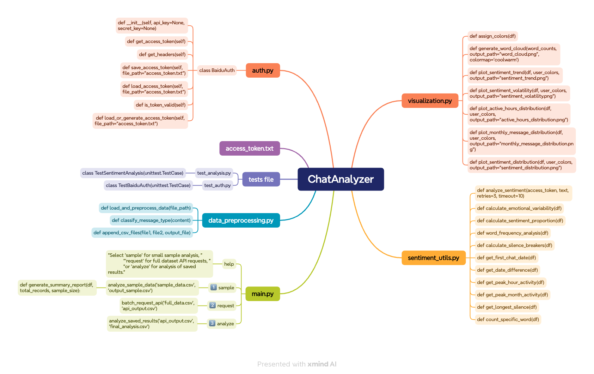

# ChatAnalyzer

## 项目简介 / Project Overview

ChatAnalyzer 是一个用于分析中文聊天数据的工具，能够对聊天记录进行情绪分析、数据可视化以及用户行为统计。设计初衷为帮助个人用户间从大量聊天记录中提取行为信息。后续如果能批量请求调用百度API的话，可以用于企业用户行为报告的营销活动，例如“年度总结报告”。

ChatAnalyzer is a tool for analyzing Chinese chat data, enabling sentiment analysis, data visualization and user behavior statistics on chat transcripts. It is designed to help individual users to extract behavioral information from a large number of chat records. It can be used in marketing campaigns for corporate user behavior reports, such as “annual summary report”, if it can call Baidu API in bulk.

---

## 功能简介 / Features
### 1. 数据预处理 / Data Preprocessing
- 支持随机抽取聊天记录中的 100 条（可自定义）进行小样本分析。
- 过滤非文本消息，例如图片和表情包。
- 自动修正时间格式并解析相关字段。

Supports random sampling of 100 chat records (customizable) for small-sample analysis.
- Filters non-text messages such as images and emojis.
- Automatically corrects time formats and parses relevant fields.

### 2. 情绪分析 / Sentiment Analysis
- 调用百度 NLP API，对每条聊天记录的情绪进行分类（正面、中性、负面）。
- 支持对整个样本或小样本进行情绪分析。
- 使用 API 返回的置信度对情绪结果进行加权。

Utilizes Baidu NLP API to classify the sentiment of each chat message (positive, neutral, negative).
- Supports sentiment analysis for both full and small sample datasets.
- Confidence-weighted sentiment results based on API feedback.

### 3. 数据可视化 / Data Visualization
- 绘制用户情绪趋势图，展示特定时间内情绪波动。
- 生成用户情绪分布图，直观展示用户的情绪类别分布。
- 绘制用户在不同时间段的活跃度分布图。
- 生成用户的月度消息分布图。
- 使用词云展示聊天中高频词汇。

Plots user sentiment trends, showing sentiment volatility over time.
- Generates sentiment distribution charts to visualize user sentiment categories.
- Visualizes user activity during different time periods.
- Displays monthly message distribution for each user.
- Generates word clouds to display high-frequency words in chats.

### 4. 用户行为统计 / User Behavior Statistics
- 统计用户的消息数量、总字数、平均字数。
- 计算用户的情绪波动（正面与负面概率的标准差）。
- 分析用户的消息时间间隔，识别“破冰者”和“消失者”。
- 对特定关键词进行频率统计，例如“哈”。

Calculates message count, total word count, and average word count per user.
- Measures user emotional variability (standard deviation of positive and negative probabilities).
- Analyzes message time intervals to identify "Ice Breakers" and "Vanishers."
- Counts specific keywords' frequency, such as "ha."

---

## 安装说明 / Installation Instructions

### 1. 使用 pip 安装 / Install via pip

ChatAnalyzer 可以通过 pip 进行安装，请在终端中运行以下命令：

ChatAnalyzer can be installed via pip. Please run the following command in the terminal:

```bash
pip install chatanalyzer
```

### 2. 安装所需依赖包 / Install Required Dependencies

为了确保工具运行正常，您需要安装以下依赖包，可以使用以下命令来安装：

To ensure that the tool runs normally, you need to install the following dependency packages, which can be installed using the following command:

```bash
pip install seaborn wordcloud setuptools wheel jieba tqdm pandas matplotlib
```

- **seaborn**：用于生成数据可视化图表。For generating data visualization charts. 
- **wordcloud**：用于生成词云图。For generating word cloud maps. 
- **setuptools & wheel**：用于打包和安装 Python 包。For packaging and installing Python packages.
- **jieba**：用于中文文本的分词处理。For Chinese text segmentation processing.
- **tqdm**：用于进度条显示。For progress bar display.
- **pandas**：用于数据处理和分析。For data processing and analysis.
- **matplotlib**：用于生成各种可视化图表。For generating various visualization charts.

---

### 3. 导出微信聊天记录为 CSV / Export WeChat Chat History to CSV

要分析微信聊天记录，建议用户使用这个开源工具导出聊天记录为 CSV 格式：[WeChatMsg](https://github.com/LC044/WeChatMsg/)。请按照该项目的说明进行安装和使用，以便将您的微信聊天记录导出为 ChatAnalyzer 支持的 CSV 格式。

To analyze WeChat chat history, users can use this open source tool to export chat history to CSV format: [WeChatMsg](https://github.com/LC044/WeChatMsg/). Please follow the instructions of this project to install and use it in order to export your WeChat chat history to the CSV format supported by ChatAnalyzer.

### 4. 配置 Baidu API 密钥 / Configure Baidu API key

要使用本工具，您需要提供[百度 NLP API](https://ai.baidu.com/ai-doc/REFERENCE/Ck3dwjgn3) 的 API Key 和 Secret Key。程序会根据这些密钥自动生成 Access Token。

To use this tool, you need to provide the API Key and Secret Key of the [Baidu NLP API](https://ai.baidu.com/ai-doc/REFERENCE/Ck3dwjgn3). The program will automatically generate an Access Token based on these keys.

请将获得的token保存到 `access_token.txt` 文件中供后续使用。

Please save the obtained token to the `access_token.txt` file for future use.


---

## 使用指南 / Usage Guide


### 1. 选择模式 / Select Mode
ChatAnalyzer 提供以下三种模式，用户可以根据需求选择不同的分析模式：

ChatAnalyzer provides the following three modes, and users can choose different analysis modes according to their needs:

- `sample`  
  进行小样本数据分析（随机抽取 100 条聊天记录）。A small sample of data was analyzed (100 randomly selected chat logs).
  
  ```bash
  chatanalyzer sample
  ```

- `request`  
  进行全量数据分析，将数据批量发送至百度 API。Perform full data analysis and send data to the Baidu API in batches.
  
  ```bash
  chatanalyzer request
  ```

- `analyze`  
  分析从 API 返回的结果并生成数据统计和可视化。Analyze the results returned from the API and generate data statistics and visualizations.
  
   ```bash
  chatanalyzer analyze
  ```

---

### 2. 数据文件命名和存储路径 / Data File Naming and Storage Path
- `sample`  
  输入文件名：`sample_data.csv`  
  存放路径：将文件存储在运行命令的同级目录中。

- `request`  
  输入文件名：`full_data.csv`  
  存放路径：同样存储在当前目录中，API 返回结果将保存为 `api_output.csv`。

- `analyze`  
  输入文件名：`api_output.csv`  
  分析结果输出为 `final_analysis.csv`，图表保存为 `.png` 文件。

The data file naming and storage path are as follows:
- `sample`  
  Enter the file name: `sample_data.csv`  
  Storage path: Store the file in the same level directory as the command being run.

- `request`  
  Enter the file name: `full_data.csv`  
  Storage path: Also stored in the current directory, the API return result will be saved as `api_output.csv`.

- `analyze`  
  Enter the file name: `api_output.csv`  
  The analysis results are output as `final_analysis.csv` and the charts are saved as `.png` files.

---

### 3. 输出结果 / Output
分析结果以易读格式输出，包含以下部分：

The analysis results are output in an easy-to-read format and include the following components:

1. **文本（Text）**：
   - 包括详细的用户消息数量、字数、破冰者/消失者比例、情绪波动等统计数据。
   - Detailed user statistics such as message count, word count, ice-breaker/vanisher ratios, emotional variability, etc.

2. **图片（Images）**：
   - 各种可视化图表，如用户活跃时间分布图、用户情绪趋势图、月度消息分布图、词云图。
   - Various visual charts, including user activity time distribution, sentiment trends, monthly message distribution, and word clouds.

3. **统计数据（Statistics）**：
   - 保存为 CSV 文件，例如 `final_analysis.csv`，包含所有统计和分析结果。
   - Saved as a CSV file (e.g., `final_analysis.csv`) that contains all statistics and analysis results.

4. **与用户互动（Interaction with User）**：
   - 用户可以输入特定词或字符以获取其在聊天中的频率统计。
   - The user can input specific words or characters to get their frequency in the chat.

--- 

## 许可 / License
该项目已获得MIT许可——详情请参阅[许可](LICENSE)文件。
This project is licensed under the MIT License - see the [LICENSE](LICENSE) file for details.
